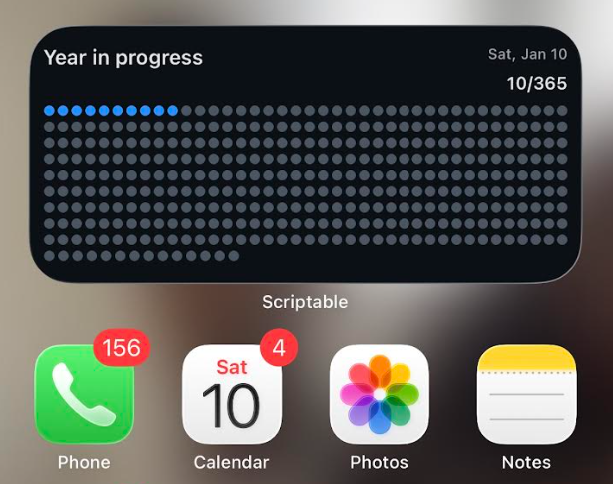

# Year-in-progress-365

A Scriptable iOS widget that visualizes the year as **365 dots**, with each day filling in as time passes.

Built for reflection, intention, and momentum — a quiet reminder that progress is happening, one day at a time.

---
## Preview

  
  

---

## How to install

1. Download **Scriptable** from the App Store
2. Choose a widget version below
3. Copy the script code
4. Paste it into Scriptable → **Save**

### Add the widget to your Home Screen

5. Go to your **Home Screen**
6. Press and hold anywhere until the icons start **wiggling**
7. Tap **Edit** in the top-left corner
8. Tap **Add Widget**
9. Search for **Scriptable**
10. Swipe to select the **Medium (horizontal)** widget
11. Tap **Add Widget**
12. Tap the widget you just added
13. Select the script you saved in Scriptable
14. Done 🎉

---

## Choose your version

- 🌙 **Dark mode widget:** [widget-dark.js](./widget-dark.js)
- ☀️ **Light mode widget:** [widget-light.js](./widget-light.js)

Click a file above, then use the **Copy** button to paste it directly into Scriptable.

---

## Widget size

This widget is designed specifically for a **Medium (horizontal) Scriptable widget**.

For best results:
- Add a **Medium-sized** widget
- Use the **horizontal layout**
- Other sizes or orientations may not display correctly

---

## Notes

## Notes

- The widget updates automatically based on the current date
- The widget is set to automatically update once per day at **1:00 AM EST**
- Designed for iOS Home Screen use via Scriptable
- Best viewed with sufficient horizontal space

---

## License

MIT License — free to use, modify, and share.
